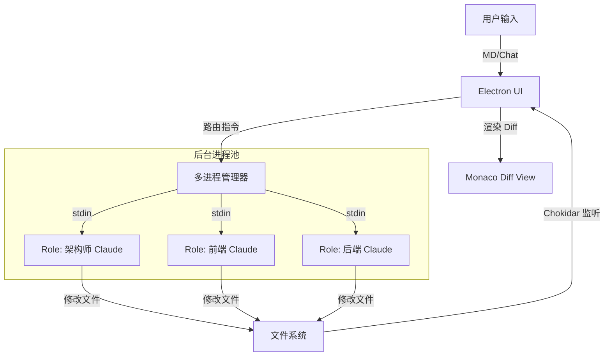

# Neuro-IDE：以 Markdown 为核心的 AI 原生开发环境

作者：杨正武
来源：https://imcoders.cn/blog/neuro-ide/
发布：2026-03-13T00:00:00.000Z
更新：2026-03-13T00:00:00.000Z

基于 Electron 边车架构的多角色终端 IDE

---


## 引言

大多数 AI 工具以命令行形式存在，开发者需要在终端和 IDE 之间频繁切换，导致上下文割裂、状态难以保持。

为了解决这个问题，我开发了 Neuro-IDE。这是一个以 Markdown 文档为核心、多角色 CLI 为引擎的桌面端 AI 开发环境。

## 核心设计

Neuro-IDE 的定位是成为开发者与 AI 工具链之间的中间层。通过将碎片化的命令行交互转化为持久化、可视化的 IDE 元数据，让 AI 成为开发者的深度协作伙伴。

### Electron 边车架构



前端使用 React + Tailwind CSS 负责 UI 交互。后端使用 Electron + Node.js 负责系统 I/O。引擎层让第三方 CLI 工具作为子进程运行。中间件使用 node-pty 终端模拟和 chokidar 文件监听。

## 三栏布局设计

### 左栏：资源管理器

左侧占 20% 宽度。包含角色切换器，点击头像切换后台 AI 会话。智能文件树支持拖拽文件到中间栏生成引用。星标文件用于快速访问常用文件。

### 中栏：控制中心

中间占 40% 宽度。Markdown 画布是项目的 Source of Truth，支持双向链接。对话流控制台是 CLI 的输入输出窗口，支持 ANSI 解析。

### 右栏：舞台面板

右侧占 40% 宽度。多态容器平时是 Monaco 代码编辑器，AI 改代码时自动切换为 Diff 对比视图。兜底终端支持一键切换为纯 xterm.js 视图。

## 核心功能

### 多角色终端系统

在 AI 辅助开发中，不同技术领域的问题需要不同的上下文和角色定位。每个角色对应一个独立的 pty 进程。后台进程始终保持 Keep-Alive 状态。前端切换 Tab 时仅切换数据流订阅源。

架构师角色负责整体设计、技术选型、架构决策。前端角色负责 UI 组件、样式、用户交互。后端角色负责 API 设计、数据库、业务逻辑。

### 文件拖拽注入

从左侧文件树拖拽文件到中间 Markdown 编辑器，UI 显示为胶囊形式。后台自动向当前激活的 CLI 发送添加文件指令。AI 获得文件上下文后可以进行针对性分析和修改。

### 智能 Diff 触发

使用 chokidar 监听项目目录下的文件变更。检测到变更事件且当前处于 AI 生成状态时，右侧栏自动锁定并展示 Diff 对比视图。提供 Accept 和 Reject 按钮。

### Claude Code 深度集成

历史记录浏览器全面集成 Claude Code 对话历史。项目自动检测功能识别当前工作区相关的 Claude 项目。数据可视化展示 Token 使用情况。离线持久化将历史数据存储在 .neuro 文件夹中。文件变更追踪自动追踪 AI 修改的文件。

## 技术栈

### 核心框架

Electron 是成熟的桌面应用框架，跨平台支持完善。React 组件化状态管理最强，适合复杂 IDE 场景。Vite 的 Electron-Vite 模板开发体验快。Zustand 轻量级，适合管理 Session 状态。

### 关键库

node-pty 提供真正的系统进程管理。xterm.js 提供流畅的终端体验。@monaco-editor/react 是微软官方封装，支持 Diff。react-markdown 提供 GitHub 风格的实时预览。chokidar 是 Node.js 端稳定的文件监听库。Tailwind CSS 配合 shadcn/ui 快速构建美观 UI。

## 开发进展

第一阶段实现了带皮肤的终端，初始化 Electron + Vite + React，集成 node-pty 与 IPC 通信。

第二阶段实现了三栏布局与 Markdown，引入 react-resizable-panels，实现可折叠面板与双栏 Markdown 编辑器。

第三阶段实现了 IDE 的灵魂，多角色 Session 管理，chokidar 文件监听与 Monaco Diff 视图，星标文件、变更文件追踪。

第四阶段正在进行集成的 AI 工作流。已完成 Claude History 浏览器、配置管理器、工作空间自动化。待完成多标签页编辑器、增强型 AI 对话。

## 方案优势

### 上下文持久化

传统方式中，每次打开新的终端会话，AI 都需要重新获取上下文，对话历史散落在不同终端窗口。Neuro-IDE 中，每个 AI 角色的会话始终保持 Keep-Alive，完整的对话历史可视化展示，随时回溯。

### 状态可视化

传统方式中，AI 修改文件后需要手动 git diff 查看，修改历史难以追踪。Neuro-IDE 自动检测文件变更并触发 Diff 视图，变更文件列表一目了然，支持快速操作。

### 工作流集成

传统方式中，终端、编辑器、浏览器分离，需要频繁切换。AI 对话、代码编辑、文档管理割裂。Neuro-IDE 的三栏布局将文档、对话、代码统一在同一界面，拖拽文件即可注入 AI 上下文。

## 快速开始

### 环境依赖

Node.js v18+ 是推荐版本。支持 macOS、Windows、Linux。

### 安装步骤

```bash
# 克隆项目
git clone https://github.com/auenger/neuro-ide
cd neuro-ide

# 安装依赖
npm install

# 启动开发环境
npm run dev

# 打包生产应用
npm run build:mac    # macOS
npm run build:win    # Windows
npm run build:linux  # Linux
```

## 未来方向

多标签页编辑器将支持同时编辑多个代码文件。直接 AI 对话无需 CLI，直接在 UI 中集成 LLM API。插件系统允许第三方扩展，自定义角色和增强终端功能。与 VRT 融合将集成自动化测试引擎，实现 Spec 到 Code 到 Test 到 Report 的全链路闭环。

## 相关链接

- GitHub: https://github.com/auenger/neuro-ide
- AILock-Step 协议: https://github.com/auenger/AILock-Step
- Visual Replay Tester: https://github.com/auenger/Visual-Replay-Tester
