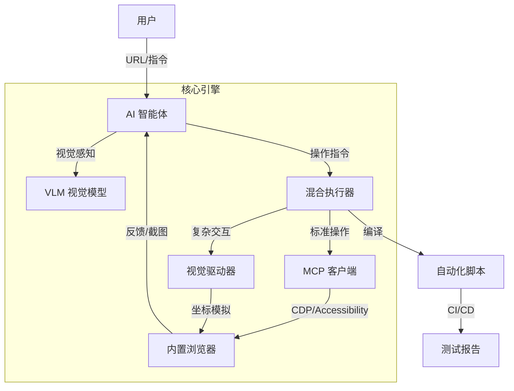

# Visual Replay Tester：下一代桌面自动化测试工具

作者：杨正武
来源：https://imcoders.cn/blog/visual-replay-tester/
发布：2026-03-13T00:00:00.000Z
更新：2026-03-13T00:00:00.000Z

基于 Electron + Playwright + MCP 的 AI 驱动测试平台

---


## 引言

传统前端 E2E 测试存在两个问题。脚本维护成本高，UI 变动会导致测试失败。视觉覆盖不全，Canvas、Shadow DOM 等场景难以测试。

为了解决这些问题，我开发了 Visual Replay Tester (VRT)。这是一个集成了 Playwright、Electron 和 MCP 的自动化测试工具。

## 核心理念

VRT 的核心价值在于将昂贵的 AI 推理转化为低成本、高稳定性的工程化脚本。初次探索使用 AI，后续回归使用固化脚本，成本大幅降低。

### 架构设计

VRT 实现了输入 URL 返回测试报告的全自动闭环。



## 四层自动化体系

### L1 高保真录制回放

适用于冒烟测试和固定业务流程回归。首选策略基于唯一 CSS 选择器进行精准操作。当选择器失效时，降级策略自动切换至空间坐标系。关键步骤强制进行视觉 Diff，确保渲染层面的正确性。

### L2 CDP 语义交互

适用于动态复杂页面和高频交互场景。不依赖脆弱的 DOM 结构，而是基于稳定的无障碍语义树。根据 Viewport 和交互上下文，只提取即时可用的语义节点。

### L3 纯视觉 AI

适用于 Shadow DOM、Canvas、Web 游戏。利用 VLM 像人类一样通过截图理解屏幕。默认使用 CDP 获取轻量级语义，仅在遇到黑盒区域时才唤起 VLM。

### L4 智能 Agent

适用于探索性测试和模糊指令执行。基于观察、思考、行动、修正的循环。将 Agent 的探索过程持久化为标准测试脚本。

## 混合执行引擎

### MCP 高速通道

对于标准 HTML 元素，通过 MCP 协议直接调用 CDP 接口。这种方式速度快、稳定性高、可记录为标准代码。能处理 80% 的标准 DOM 操作。

### VLM 视觉直觉

当遇到 Canvas 画布、极度混淆的 DOM、ShadowRoot 内部时，调用 VLM 进行判断。计算目标图像坐标，模拟鼠标物理点击。

## 核心功能

### 智能 MCP 自动化

自然语言控制，告诉 AI 测试搜索功能，它会自动规划并执行。使用语义化的定位方式，告别脆弱的 CSS 选择器。完全兼容 Model Context Protocol。

### 内嵌录制工作室

直接在 Electron 应用内进行录制和调试。拖拽式编辑测试步骤。自动捕获关键节点的视觉状态。

## 技术栈

Frontend 使用 React + TypeScript + TailwindCSS。Backend/Main 使用 Electron + Node.js。Protocol 采用 Model Context Protocol。Browser 使用 Playwright + Chrome DevTools Protocol。

## 方案对比

| 方案层级 | 核心技术 | 关键优势 | 推荐场景 |
|---------|---------|---------|---------|
| L1 | 高保真录制 | 100% 复现，零代码成本 | 核心流程冒烟，固定回归 |
| L2 | CDP 语义交互 | 极高健壮性，抗 UI 变动 | 复杂表单，动态单页应用 |
| L3 | 纯视觉 AI | 无视 DOM 限制 | Canvas，游戏，第三方插件 |
| L4 | 智能 Agent | 自主探索，生成可复用脚本 | 新功能探索，模糊任务 |

## 成本分析

只在初次探索和生成脚本阶段大量消耗 Token 和算力。脚本生成后，后续回归测试仅运行固化的脚本，成本趋近于零。

通过 VLM 视觉方案，解决了 Canvas、WebGL 等传统自动化工具难以处理的场景。完整的闭环包括生成、验证、报告三个阶段。

## 快速开始

### 环境要求

Node.js v20+ 是必需的。支持 macOS、Windows、Linux。

### 安装步骤

```bash
# 克隆项目
git clone https://github.com/auenger/Visual-Replay-Tester
cd Visual-Replay-Tester

# 安装依赖
npm install

# 安装浏览器内核
npx playwright install chromium

# 启动开发环境
npm run dev
```

## 相关链接

- 官网: https://vrtest.cn
- GitHub: https://github.com/auenger/Visual-Replay-Tester
- MCP 协议: https://modelcontextprotocol.io
